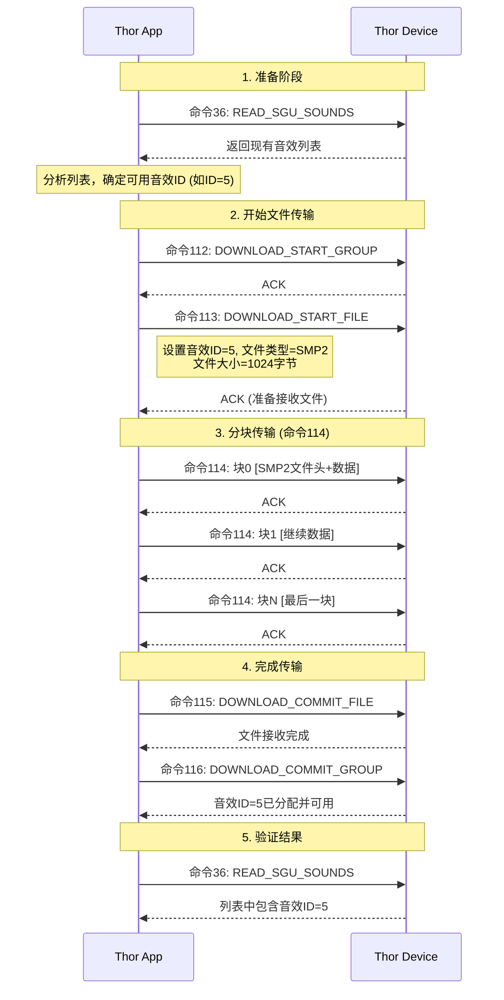

# Thor音效上传完整流程分析

## 🎯 命令114之前的完整逻辑链条

### 1. 音效ID的确定逻辑

#### 1.1 读取现有音效列表
```
命令36: READ_SGU_SOUNDS
→ 获取设备当前所有音效状态
→ 返回: [音效ID, 启用状态] 列表
→ 确定哪些ID已被占用
```

#### 1.2 音效ID分配策略
```java
// 基于现有音效列表确定下一个可用ID
for (int soundId = 0; soundId < 256; soundId++) {
    if (!existingSounds.contains(soundId)) {
        return soundId;  // 返回第一个未使用的ID
    }
}
```

### 2. 音效上传的两种模式

#### 模式A: 直接SGU音效上传 (简单音效)
```
1. READ_SGU_SOUNDS (36) → 获取现有音效列表
2. START_WRITE_SGU_SOUND (38) → 分配音效ID，开始写入
3. WRITE_SGU_SOUND (39) → 直接写入音效数据
4. APPLY_SGU_SOUND (40) → 应用到设备
```

#### 模式B: 音效包文件上传 (复杂音效/SMP2文件)
```
1. READ_SGU_SOUNDS (36) → 获取现有音效列表
2. DOWNLOAD_START_GROUP (112) → 开始组下载
3. DOWNLOAD_START_FILE (113) → 开始文件下载，设置音效ID
4. DOWNLOAD_WRITE_BLOCK (114) → 分块传输SMP2文件 ⭐
5. DOWNLOAD_COMMIT_FILE (115) → 提交文件
6. DOWNLOAD_COMMIT_GROUP (116) → 提交组
7. DOWNLOAD_GET_STATUS (117) → 获取上传状态
```

### 3. 命令113的关键作用 (114之前的铺垫)

#### 3.1 DOWNLOAD_START_FILE (113) 数据格式
```
[填充长度][分隔符][命令113][音效ID][文件类型][文件大小][文件名...]
│           │       │        │      │        │        │
│           │       │        │      │        │        └─ 文件名 (如"sound_001.smp")
│           │       │        │      │        └─ 文件总大小 (字节)
│           │       │        │      └─ 文件类型 (0x01=SMP2音效)
│           │       │        └─ 指定的音效ID (0-255)
│           │       └─ 命令113
│           └─ 分隔符 (通常为0x00)
└─ 填充长度
```

#### 3.2 命令113的作用
- **分配音效ID**: 告诉设备将要上传的音效使用哪个ID
- **设置文件信息**: 文件大小、类型、名称
- **初始化传输会话**: 准备接收后续的114块数据
- **预分配存储空间**: 设备为即将到来的文件数据预留空间

### 4. 命令114的详细数据结构

#### 4.1 你提供的数据分析
```
第一块: 1,0,114,0,0,0,200,83,77,80,50,0,48,0,0,0,198...
        │ │ │   │ │ │ │   │  │  │  │  │ 
        │ │ │   │ │ │ │   └──┴──┴──┴──┴─ "SMP2" 文件头
        │ │ │   │ │ │ └─ 数据长度 (200字节)
        │ │ │   └─┴─┴─ 块序号 (0,0,0 = 第0块)
        │ │ └─ 命令114
        │ └─ 分隔符
        └─ 填充长度

第二块: 1,0,114,0,1,0,200,... (块序号 0,1,0 = 第1块)
第三块: 1,0,114,0,2,0,200,... (块序号 0,2,0 = 第2块)
```

#### 4.2 块序号编码规则
```
blocks_seq = (byte1 << 16) | (byte2 << 8) | byte3
第0块: 0,0,0 → 0
第1块: 0,1,0 → 256  
第2块: 0,2,0 → 512
...
```

### 5. 完整的上传时序图



### 6. 关键的铺垫逻辑

#### 6.1 音效ID冲突检测
```java
// 上传前必须检查ID是否已被占用
List<Integer> existingSoundIds = readSguSounds();
if (existingSoundIds.contains(targetSoundId)) {
    throw new SoundIdConflictException("音效ID已存在");
}
```

#### 6.2 设备存储空间检查
```java
// 命令113发送后，设备会检查存储空间
// 如果空间不足，会返回错误状态
if (getAvailableStorage() < fileSize) {
    return ERROR_INSUFFICIENT_STORAGE;
}
```

#### 6.3 传输会话管理
```java
// 命令113建立传输会话，命令114使用该会话
TransferSession session = createTransferSession(soundId, fileInfo);
// 后续所有命令114都关联到这个会话
```

### 7. 实际代码示例

#### 7.1 完整上传流程的伪代码
```python
async def upload_smp2_file(smp2_data, target_sound_id=None):
    # 1. 读取现有音效列表
    existing_sounds = await send_command(36)  # READ_SGU_SOUNDS
    
    # 2. 确定音效ID
    if target_sound_id is None:
        target_sound_id = find_next_available_id(existing_sounds)
    elif target_sound_id in existing_sounds:
        raise Exception(f"音效ID {target_sound_id} 已被占用")
    
    # 3. 开始组下载
    await send_command(112)  # DOWNLOAD_START_GROUP
    
    # 4. 开始文件下载，设置音效ID和文件信息
    file_info = {
        'sound_id': target_sound_id,
        'file_type': 0x01,  # SMP2类型
        'file_size': len(smp2_data),
        'file_name': f'sound_{target_sound_id:03d}.smp'
    }
    await send_command(113, file_info)  # DOWNLOAD_START_FILE
    
    # 5. 分块传输文件数据
    block_size = 200  # 每块大小
    for block_idx, block_data in enumerate(split_into_blocks(smp2_data, block_size)):
        block_packet = create_block_114(block_idx, block_data)
        await send_command(114, block_packet)  # DOWNLOAD_WRITE_BLOCK
    
    # 6. 提交文件和组
    await send_command(115)  # DOWNLOAD_COMMIT_FILE
    await send_command(116)  # DOWNLOAD_COMMIT_GROUP
    
    # 7. 验证上传结果
    final_sounds = await send_command(36)  # READ_SGU_SOUNDS
    if target_sound_id in final_sounds:
        print(f"✅ 音效ID {target_sound_id} 上传成功!")
        return target_sound_id
    else:
        raise Exception("上传失败，音效未出现在设备列表中")
```

### 8. 常见问题和注意事项

#### 8.1 音效ID管理
- **ID范围**: 0-255
- **系统预留**: 某些ID可能被系统预留
- **冲突处理**: 上传前必须检查ID可用性

#### 8.2 文件传输可靠性
- **块序号**: 必须严格按顺序传输
- **数据完整性**: 每块都有CRC校验
- **错误恢复**: 传输失败需要重新开始

#### 8.3 设备限制
- **存储容量**: 设备有音效存储上限
- **并发限制**: 同时只能进行一个文件传输
- **格式支持**: 只支持特定的SMP2格式

这就是命令114之前的完整铺垫逻辑！音效ID通过命令36获取现有列表后确定，通过命令113设置到设备，然后命令114负责实际的文件数据传输。